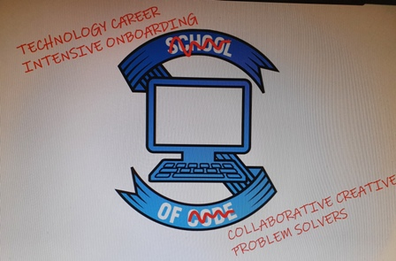
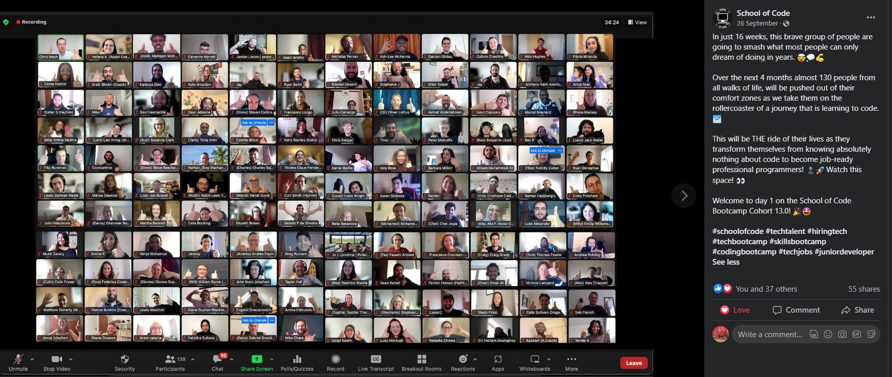
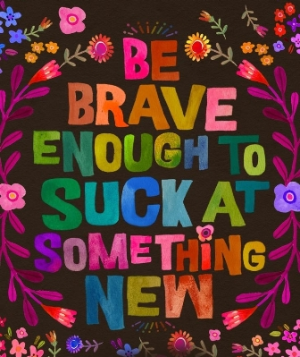
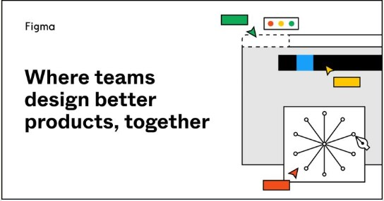
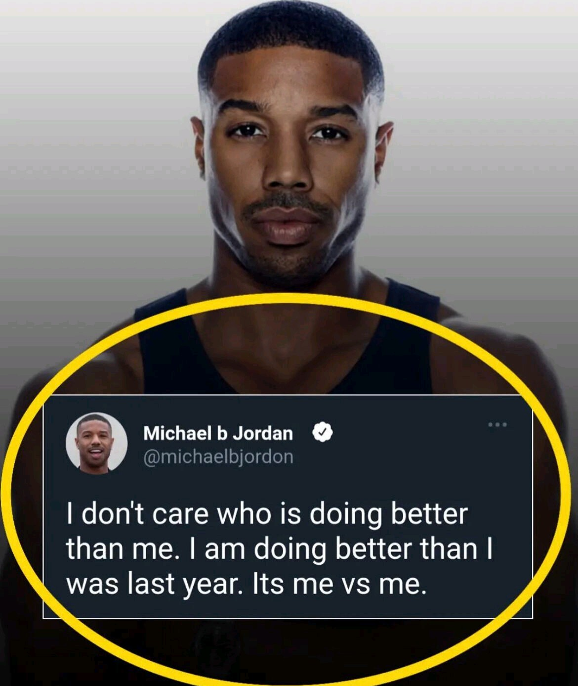

# 100 Days Of Code Log

### Introduction

 

Welcome to my #100 Days of Code Log as I take on the challenge to code at least an hour a day for the next 100 days! I am joining the brave new world of learning how to code by starting the School of Code's full stack web development bootcamp. It's full time for the next four months but it's also free. The application process was lengthy but they only accepted 130 people out of nearly 3000 applicants. How could I turn down the opportunity?
#careerchange #womenintech



### Day 1: 26 September 2022

**Today's Progress**: Learned new CSS selectors and practiced them while pair programming with CSS Diner

**Link(s) to work**: [CSS Diner](https://lnkd.in/ePbUsARa) 

**Thoughts:** Made it through my first day at School of Code and loved it. The founder and CEO, Chris Meah, told us today that a more accurate name for School of Code is "Technology Career Intensive Onboarding of Collaborative Creative Problem Solvers." I am excited to start my journey learning to code with all these new people!  



### Day 2: 27 September 2022

**Today's Progress**: 
- Reviewed and practiced basics of Git and Github.
- Learned about computational thinking:
    - Understand the problem
    - Decompose the problem (break it down into smaller parts)
    - Recognize patterns
    - Abstraction (filter out/ignore the characteristics of the problem that are not needed).
    - Create algorithms
- Problem solved in pairs with flow charts and with puzzles such as Hack the Galaxy.

**Link(s) to work**: [Hack the Galaxy](https://www.hackthegalaxy.dev/) 

### Day 3: 28 September 2022

**Today's Progress**: 
- Started learning JavaScript with The School of Code
- Practiced pair programming in JavaScript using Visual Studio Code, Git, and GitHub

### Day 4: 29 September 2022

**Today's Progress**: 
- Learned about objects and arrays in JavaScript
- Declared objects and arrays, read object and array values, created loops, accessed objects and arrays, and reassigned properties. Completed all these tasks (and more!) by pair programming with my teammate using Visual Studio Code, Gitbash, and Github.
- Plus, I had a fantastic first meeting with my mentor this evening.

### Day 5: 30 September 2022

**Today's Progress**: 
Spent the whole day programming in #javascript and #problemsolving with my teammate in our first 
the School Of Code. We built a Rock, Paper, Scissors game from scratch.

**Thoughts:** I enjoy this catchy School of Code hackathon tune that gets us all fired up to take on the day - [Hackathon Fridays.](https://open.spotify.com/track/4oHKTtoYPBhfZBiTtO4OIP?si=s_USUc5gQByXnMzciOlWWQ&utm_source=copy-link&nd=1)

### Day 6: 1 October 2022

**Today's Progress**: 
- Signed up to #codewars and practiced breaking down problems into solvable chunks and problem solving in pairs. Wrote functions in JavaScript to solve our first kata (challenge) together.
- Learned about the Document Object Model (DOM) in JavaScript - how to create, append, and add elements to the DOM. Attempted to practice what we'd learned with my programming pair partner.

### Day 7: 2 October 2022

**Today's Progress**: 
- Signed up to #codewars and practiced breaking down problems into solvable chunks and problem solving in pairs. Wrote functions in JavaScript to solve our first kata (challenge) together.
- Learned about the Document Object Model (DOM) in JavaScript - how to create, append, and add elements to the DOM. Attempted to practice what we'd learned with my programming pair partner.

### Day 8: 3 October 2022

**Today's Progress**: 
- Signed up to #codewars and practiced breaking down problems into solvable chunks and problem solving in pairs. Wrote functions in JavaScript to solve our first kata (challenge) together.
- Learned about the Document Object Model (DOM) in JavaScript - how to create, append, and add elements to the DOM. Attempted to practice what we'd learned with my programming pair partner.

### Day 9: 4 October 2022

**Today's Progress**: 
- Learned about and practiced JavaScript Events in the Document Object Model (DOM).
- Completed another JavaScript kata in Code Wars with my pairing partner.

**Thoughts:** I'm starting to understand what a programmer does other than "works with computers." 😂


### Day 10: 5 October 2022

**Today's Progress**:
- Learned about asynchronous #javascript and practiced coding using setTimeout(), setInterval(), and clearInterval(). 
- Practiced coding in #javascript to fetch (with async) resources from Application Programming Interfaces (APIs). I learned how to do this in Python with #codefirstgirls a few months ago so thankfully I already understood the basics. 
- Completed two more katas in #codewars with my programming pair partner.

### Day 11: 6 October 2022

**Today's Progress**:
- Practiced using APIs and extracting data with my pair programming partner.
- Researched Promise.all(), Promise.any(), and Promise.race() in a small group and together we presented our learnings to a larger group of about 40 people

### Day 12: 7 October 2022

**Today's Progress**:
- Fetch Hackathon at School of Code: Made an app, with my pair programming partner, that requested data from a server.
-Used Javascript, CSS, DOM, APIs, async functions, await fetch, await response.json(), document.querySelector, addEventListener, incrementCount, setInterval

### Day 13: 8 October 2022

**Today's Progress**:
Studied and completed exercises on www.w3schools.com on the following topics in JavaScript: Variables, Data Types, Functions, Arrays, Comparison and Logical Operators, For Loops, and HTML DOM

**Link(s) to work**: [W3Schools JavaScript Tutorial](https://www.w3schools.com/js/default.asp)


### Day 14: 9 October 2022

**Today's Progress**:
Started working on Recap Week 2 workshop from School of Code which covers functions, strings, for loops, arrays, setInterval, clearInterval, and fetch. 

### Day 15: 10 October 2022

**Today's Progress**:
- Attempted to recreate the Google search page in an HTML file (without using any help or resources)
- Learned about Agile, UI (User Interface), and UX (User Experience). I was already familiar with Agile from getting my CompTIA Security+ Certification and starting the Agile Foundations LinkedIn Learning Course this past year, but UI & UX were new to me.  
- Started a newbie challenge on Front End Mentor with my new programming pair partner for this week (https://lnkd.in/eBKh6P4e)
#javascript #programming #agile #uiux

**Thoughts:** My inspirational quote for today. Saw this and it's perfect for me as I start week 3 of coding bootcamp. What new thing will you be brave enough to suck at?



### Day 16: 11 October 2022

**Today's Progress**:
- Learned about CSS Variables and completed workshop in which we created CSS variables, created a new CSS class and reassigned the CSS variables within that specific class.
- Learned about the User Experience (UX) design process. Tried our hand at it by going through the process steps starting with an idea that we came up with in our small group.
- Attempted to complete another kata (challenge) in #codewars with my pairing partner.
#css #uxdesign

### Day 17: 12 October 2022

**Today's Progress**:
User Interface (UI) design:
· Learned about the elements and principles of UI design.
· Created a low fidelity wireframe on www.figma.com.
· Learned how to generate a Lighthouse report to analyse the accessibility of a web app.
· Played the “Can’t Unsee” game with my programming pair partner where you pick the design that is most correct. https://cantunsee.space/
· Explored colour palettes on https://coolors.co/ and https://paletton.com/

CSS:
· Learned about Specificity in CSS https://lnkd.in/e2aerhUz 
· Also learned how to name CSS classes to make them more specific
#css #ui



### Day 18: 13 October 2022

**Today's Progress**:
· For a UX design group project, we analysed a company’s website and presented our recommendations on how to improve the accessibility of the website.
· CSS (Cascading Style Sheets) is the code that styles web content. Learned about flex, gap, viewpoint height, and viewpoint width in CSS. #css #project #uxdesign #accessibility

### Day 19: 14 October 2022

**Today's Progress**:
Yesterday was Hackathon Friday at School Of Code. We used our newly developed UI/UX skills to design a business landing page. Working together in a pair we:
· Created user stories and user personas to identify users' needs and the problem we needed to solve.
· Made a user journey flow diagram on www.lucidchart.com
· Created low and high-fidelity wireframes using www.figma.com and miro.com
· Chose our colour scheme (via coolors.co) and tested our colours for accessibility. For example, we checked to see if the colours we chose had enough contrast so that people who are colour-blind can still distinguish them.
#uiuxdesign #collaboration

### Day 20: 15 October 2022

**Today's Progress**:
- Continued coding functions, loops, and arrays for the JavaScript Recap workshop with School Of Code.
- One of the many things I love about School of Code is they connect each of us with a mentor who works in the tech industry already and is willing to meet with us 1:1 each week. Arthur is my mentor and he has encouraged me so much already with his tips, advice, and support. He sent me an inspiring quote this morning when I was feeling discouraged and I've been repeating it to myself all day. Thank you, Arthur! 

    

#javascript #mentoring

### Day 21: 17 October 2022

**Today's Progress**:
· Learned some tips on how to debug code
· Started learning about Back End Development. As part of that, with my new pairing partner, we:
    o  installed Node.js
    o  Created, imported and exported modules using CommonJS
    o  Imported JSON data using CommonJS
· My favourite quote from our coach, Loz, today (paraphrased):  “You can’t really understand something in coding just by watching someone do it. You only become familiar with it that way. You have to do it to understand it.”
#backenddevelopment #nodejs #json #debugging

### Day 22: 18 October 2022

**Today's Progress**:
This week we are learning about backend development. We are using Nodejs (an open-source javascript runtime) to run JavaScript outside the browser.
- Today we learned how to use modules (built-in libraries) to interact with systems.
- We dealt with Node core modules and 3rd party modules like NPM.
- With my pair partner, I practiced:
- Reading and writing to files using the fs module.
- Used uuid (a third party package) to generate unique ids.
- Serialized and deserialized data using the JSON.parse and JSON.stringify methods.
- Started learning how to build a web server using expressjs.com.

#nodejs #backenddevelopment #json #expressjs


### Day 23: 19 October 2022

**Today's Progress**:
· Built a REST API using Node.js and Express
· Created API endpoints allowing the user to create, read, update and delete a resource
· Used Postman to make HTTP requests to test API endpoints. Postman is an API platform for building and using APIs.
· Installed nodemon on NPM. nodemon is a tool that helps develop Node.js based applications by automatically restarting the node application when file changes in the directory are detected.
#api #restapi #nodejs #expressjs #postmanapi

### Day 24: 20 October 2022

**Today's Progress**:
- Learned how to create custom Middleware
- Installed a third party Middleware package called morgan which logs the details of requests.
- Used a built in middleware to serve static files

### Day 25: 21 October 2022

**Today's Progress**:
Hackathon Friday at School of Code on Building a Back End.
Built a REST API from scratch. Set up CRUD routes and got them running in our router. Created model functions and passed them to route handlers in the router.

### Day 26: 23 October 2022

**Today's Progress**:
Forked the repo from the workshop that I did with my programming pair partner last week on Building a REST API using Node.js and Express. Did it again from scratch by myself this time to reinforce what I had learned.
- Created API endpoints allowing the user to create, read, update and delete a resource (Set up CRUD routes in my router so that my server is listening for requests and serves test responses).
- Used Postman to make HTTP requests to test API endpoints.
#middleware #restapi #nodejs #postmanapi #apitesting


### Day 27: 24 October 2022

**Today's Progress**:
This week, we are learning about the programming language, SQL.
▪ Structured Query Language (SQL) was designed for managing data that is held in a relational database management system.
▪ We practiced performing CRUD (Create, Read, Update, Delete) operations in SQL via the website db-fiddle.com. 
#sql #database

### Day 28: 25 October 2022

**Today's Progress**:
▪ Learned about joining SQL tables, SQL keywords, functions, and how to query a database. I am loving SQL so far.
▪ My favourite part of today was solving the SQL Murder Mystery with my new programming partners this week (we're pair programming in a team of 3).
#sql #postgresql

### Day 29: 26 October 2022

**Today's Progress**:
Today, we learned how to connect a library to a database.
▪ Created a Postgres database on ElephantSQL.
▪ Created Environment variables.
▪ Learned how to use the dotenv package to load environment variables.
▪ Connected to the PostgreSQL database using a pool from the pg package and export a query method. This allowed us to execute SQL queries in our models and other files.
▪ Wrote parameterized queries and tested the APIs with Postman. 
#sql #backendwebdevelopment #postgresql #api

### Day 30: 27 October 2022

**Today's Progress**:
- Solved my first SQL kata on #codewars, with my two programming pair partners for this week, and ranked up to the next level kyu!
- Worked together with four other teammates to research and present to a larger group (of 40+ people) about error handling in Expressjs. As part of this, I learned about the JavaScript statements try{}, catch {}, finally {}, and throw {}.
#javascript #sql #expressjs #postgresql

### Day 31: 28 October 2022

**Today's Progress**:
Hackathon Friday at School Of Code!
Working together in a team of three, we:
- Created a PostgreSQL database, with multiple tables, via ElephantSQL and hosted on the Amazon Web Service (AWS) cloud. 
- Coded environment variables to store database credentials. 
- Created a fully functioning REST API with routes to manage CRUD (Create, Read, Update, Delete) requests to the database and serve responses. 
- Created the models pattern to allow easy interaction with the database. 
#aws #postgresql #restapi #backendwebdevelopment

### Day 32: 30 October 2022

**Today's Progress**:
- Forked the repos of the workshops I worked on last week with my pairing partners so I can continue to work on them on my own.
- Read article on "Getting Started with Node.js ESM" (https://lnkd.in/ePzW94Cp)
- Watched video on "JavaScript Modules: From IIFEs to CommonJS to ES6 Modules" in preparation for our School of Code homework which is to convert our previous workshops to ECMAScript modules (ESM)
(https://lnkd.in/ea3vV7RC)
#github #nodejs #esm #esma #modules #javascript

### Day 33: 31 October 2022

**Today's Progress**:
This week we are learning about testing and modern software engineering practices. We've learned about Jestjs.io, Test-driven development (TDD), and Cypress.io.
- Started converting the code that I wrote in the Build a REST API workshop from CommonJS (CJS) to ECMAScript modules (ESM).
- Used jestjs.io to do basic testing in JavaScript. Jest is a JavaScript Testing Framework. (https://jestjs.io/)

### Day 34: 1 November 2022

**Today's Progress**:
- Read about Test-driven development (TDD) and discussed the pros/cons of TDD.
- Worked on a repo, with my new programming pair partner, to practice Test-driven development (TDD)
- Learned about Cypress.io, a JavaScript-based front-end testing tool built for the modern web. It uses a DOM manipulation technique and operates directly in the browser.
#javascript #tdd #restapi #jest #cypress #ecmascript

### Day 35: 2 November 2022

**Today's Progress**:
- Wrote end-to-end tests using Cypress.io
- Learned how to automate API endpoint testing using the npmjs package superagent (https://lnkd.in/eGCANeVP).
- Decided to go back to basics this evening so I completed the first 20 lessons of the "JavaScript Algorithms and Data Structures" certification on freeCodeCamp
- Tackled more #codewars challenges, with my pairing partner, and ranked up another kyu in JavaScript 😁
#apitesting #cypress #freecodecamp

### Day 36: 3 November 2022

**Today's Progress**:
- Forked the #100daysofcode template and added all my notes from Notion, Tweets, and posts on LinkedIn from my first 35 days of the challenge into this 100 Days of Code log. It's a clear sign of how far I have come in a such a short time since when I started the 100 Days of Code challenge I didn't know how to use Github or VSCode and definitely didn't know how to fork a repo!
- Learned about NoSQL from guest speakers from Couchbase
- With my pair programming partner this week we created our own Kata for Code Wars and the tests required to check our CodeWarrior's solutions. We started with some simple ones which worked fine. Then we started creating a more complicated one but haven't finished it yet.
- We also learned about NoSQL from Couchbase at School of Code today. It was interesting to learn more about it.

**Link(s) to work**: [Free Code Camp](https://www.freecodecamp.org/fcc1c4bc12a-0732-4d31-8cf5-256370ff73f5) 

### Day 37: 4 November 2022

**Today's Progress**:
- It was Hackathon Friday at School of Code. Our goal was to create testable code for end-to-end testing and API integration testing. We did our End-to-End testing using cypress.io. This included creating a SQL database in ElephantSQL. We did our API testing using jest and supertest. As part of that we wrote the code to test GET and POST. 

### Day 38: 6 November 2022

**Today's Progress**:
- Worked on the week 6 recap homework which was to test a full stack app. 

### Day 39: 7 November 2022

**Today's Progress**:
- This week at School of Code we are covering component-based thinking and frameworks. We are specifically focused on learning how to use React, a JavaScript library used for building advanced user interfaces with a component-based architecture approach. 
- Today we learned about how to create single-page React applications using Create React App. 


### Day 40: 8 November 2022

**Today's Progress**:
-  Solved a kata with my pairing partner this week by using JavaScript String split() and the Spread (...) operator. I worked on this particular kata with two different fellow programmers so it felt wonderful to finally solve it! 
-  At School of Code today we also learned and practiced coding using:
    - JavaScript array methods such as map(), filter(), some(), every(), and sort().  
    - React components: creating, building and nesting components.

### Day 41: 9 November 2022

**Today's Progress**:
-  Learned about React useState hooks: const [state, setState] = useState(initialState)

### Day 42: 10 November 2022

**Today's Progress**:
- Learned about React lists and keys
- Immutable updates to objects and arrays

**Thoughts:** Every day on my lunch break I try to walk outside. It's great for my health and also [scientifically proven](https://news.stanford.edu/2014/04/24/walking-vs-sitting-042414/) to boost creative thinking by an average of 60 percent! A perfect aid for effective problem solving. 


### Day 43: 11 November 2022

**Today's Progress**: 
Hackathon Friday at School Of Code. We attempted to use the skills in Reactjs that we've been learning all week to create a "To do list" app. My pairing partner and I decided that we needed to go back to understanding some of the basics of React such as State and Props. As a result, we spent some time going through The Net Ninja's YouTube playlist, [Full React Tutorial](https://www.youtube.com/playlist?list=PL4cUxeGkcC9gZD-Tvwfod2gaISzfRiP9d) and discussing it to make sure we understood it.  

### Day 44: 12 November 2022

**Today's Progress**: 
- Today I learned [How to Transform Your #100DaysOfCode Log Into a Visual Experience](https://www.freecodecamp.org/news/how-to-transform-your-100daysofcode-log-into-a-visual-experience-d048334af8d9/) thanks to this Free Code Camp article. 
- I have subsequently updated this log with images, links, and formatting changes with the help of Markdown code such as:

    *Italic*
    
    **Bold**
    # Heading 1
    ## Heading 2
    [Link](http://a.com)
    
    > Blockquote
    
     * List
     * List
     * List
    
     1. One
     2. Two
     3. Three

    Horizontal rule:
    ---
    
    `Inline code` with backticks	

    ```
    # code block
    print '3 backticks or'
    print 'indent 4 spaces'
    ```

**Link(s) to resources**: 

[Markdown Tutorial](https://commonmark.org/help/)

[Markdown Tutorial and  Visual Studio Code](https://code.visualstudio.com/docs/languages/markdown#_markdown-preview) 

**Thoughts:** After an intense week, when I was sick with the flu and trying to learn how to code using React JS, I needed a mental break. I found it encouraging and motivating learning how to improve my #100daysofcode log on #github to make it more interesting to read. One of these days I'll hopefully be posting some actual projects, but for now this is a good first step. This quote from Code First Girls was just what I needed to read today:

 

 ### Day 45: 14 November 2022

**Today's Progress**: 
Learned about pure functions in Reactjs such as useEffect hook. How to fetch data from an API using fetch, useEffect and useState. 

 ### Day 46: 15 November 2022

**Today's Progress**:

Learned about branch management in Git. This included learning some new git commands such as:
* git checkout –b adding-to-remote. This creates a new branch called “adding-to-remote” and switches to it at the same time.

* git checkout main. 

* git push --set-upstream origin newBranchName

We also learned about useReducer which is a hook that allows you to manage your state in React when you want to keep everything under control.

 ### Day 47: 16 November 2022

**Today's Progress**:

Refactored a list with useReducer from The School of Code useReducer Workshop 

Worked on solving a 6kyu kata in Code Wars with my pairing partner. 

Had a refresh on writing test code in preparation for our group project next week. 

Then worked on a React Component Testing workshop.

Learned about Create React App. React Testing Library. 
 

 ### Day 48: 17 November 2022

**Today's Progress**:

Learned more about Agile working, Kanban board, Agile Sprint Iterations, MSCW (Must have, should have, could have, won’t have). etc. 

More review on Testing React Components.

We also conducted and presented Group Research projects on the following topics: 
* Breaking down a project
* Standups and retrospectives
* Estimation, story points, and story point poker
* Sprint planning
* Scrum
* Kanban
* Minimum Viable Product (MVP) and Minimum Loveable Product (MLP)


 ### Day 49: 19 November 2022

**Today's Progress**:
Continued completing lessons in the JavaScript course on FreeCodeCamp

**Link(s) to work**: [JavaScript Algorithm and Data Structures Certification Course](https://www.freecodecamp.org/fcc1c4bc12a-0732-4d31-8cf5-256370ff73f5) 

 ### Day 50: 20 November 2022

**Today's Progress**:
Continued working through lessons in the JavaScript course on FreeCodeCamp

**Link(s) to work**: [JavaScript Algorithm and Data Structures Certification Course](https://www.freecodecamp.org/fcc1c4bc12a-0732-4d31-8cf5-256370ff73f5) 